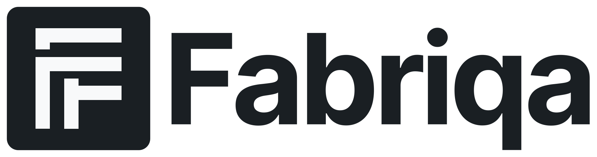

   
  <!-- Use picture element to show appropriate logo based on theme -->
  <picture>
    <source media="(prefers-color-scheme: dark)" srcset="./graphics/fabriqa_light.png">
    <source media="(prefers-color-scheme: light)" srcset="./graphics/fabriqa_dark.png">
    
  </picture>
  
  <h1>Fabriqa Public Community</h1>
  
  

    <strong>The official community hub for Fabriqa - Backend in Seconds, Not Sprints</strong>
  

  
  

    
    
    
    
    
  

 

---

## 🎯 What is Fabriqa?

Fabriqa is the first backend platform specifically designed for multi-tenant SaaS applications. We handle the complex infrastructure so you can focus on building features that matter.

### Key Features
- 🔐 **Automatic Multi-Tenancy** - Complete data isolation out of the box
- 👥 **Built-in User Management** - Authentication, teams, and permissions included
- ⚡ **Hybrid Database Architecture** - Query like SQL, scale like NoSQL
- 🕰️ **90-Day Time Machine** - Roll back any data changes
- 🚀 **Instant APIs** - Your backend ready in 30 seconds

## 🌟 Why This Repository?

This is your space to:

- 💡 **Share Ideas** - Suggest features that would make your development easier
- 🐛 **Report Issues** - Help us identify and fix bugs during our beta
- 💬 **Join Discussions** - Connect with other developers building on Fabriqa
- 📊 **Track Progress** - See what we're building and what's coming next
- 🤝 **Get Support** - Ask questions and get help from the community

## 🗣️ Join the Discussion

We've enabled GitHub Discussions as our primary community platform. Here's how to participate:

### Discussion Categories

- **📢 Announcements** - Official updates from the Fabriqa team
- **💡 Ideas & Feature Requests** - Suggest new features or improvements
- **🐛 Bug Reports** - Report issues you've encountered
- **❓ Q&A** - Ask questions and get help
- **🎯 Show and Tell** - Share what you're building with Fabriqa
- **💬 General** - Everything else Fabriqa-related

### How to Contribute

1. **Start a Discussion** - Click the [Discussions tab](https://github.com/astrum-forge/fabriqa-public/discussions) and choose a category
2. **Be Specific** - Include details, examples, or mockups when suggesting features
3. **Be Respectful** - We're all here to make backend development better
4. **Vote and Comment** - Support ideas you like and add your perspective

## 🗺️ Public Roadmap

We believe in building in public. Track our progress and see what's coming:

  

## 🤝 Community Guidelines

To keep our community welcoming and productive:

1. **Be Kind** - Treat everyone with respect
2. **Be Constructive** - Focus on solutions, not just problems
3. **Be Patient** - We're a small team working hard to build something great
4. **Be Clear** - Provide context and examples in your discussions
5. **Be Original** - Search existing discussions before creating new ones

## 📫 Other Ways to Connect

- **Website**: [fabriqa.io](https://fabriqa.io)
- **Email**: info@astrumforge.com
- **GitHub**: [@astrum-forge](https://github.com/astrum-forge)
- **LinkedIn**: [Fabriqa on LinkedIn](https://linkedin.com/company/afs-fabriqa)

## 🎉 Join Our Beta

We're currently in closed beta with 147+ developers already on board. Want early access?

  

 

Beta users get:
- 🎁 1 million bonus operations at launch
- 🚀 Early access to all features
- 💬 Direct line to the founding team
- 🏷️ Exclusive beta pricing

## 📄 License & Legal

This repository is for community discussion only. Fabriqa's platform code is proprietary, though our SDKs will be open source.

- [Terms of Service](https://fabriqa.io/terms)
- [Privacy Policy](https://fabriqa.io/privacy)

---

  

    Built with ❤️ by <a href="https://astrumforge.com">Astrum Forge Studios</a> in Melbourne, Australia
  

  
  

    © 2025 Astrum Forge Pty Ltd. All rights reserved.
  

